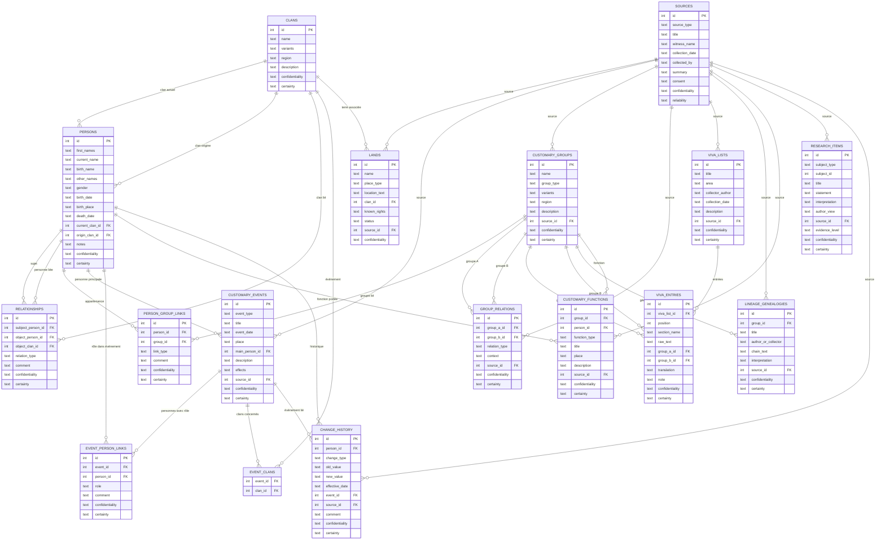

# Schéma du modèle de données

Ce fichier sert de carte visuelle commune pour discuter de la structure de l'outil.

Le diagramme ci-dessous est écrit en Mermaid. Dans Visual Studio Code, il peut être lu comme du Markdown. Si l'aperçu Mermaid n'est pas disponible, copier le bloc dans https://mermaid.live/.

## Lecture rapide

- `PERSONS` garde l'identité individuelle.
- `CLANS` reste séparé pour les cas où l'appartenance clanique est claire.
- `CUSTOMARY_GROUPS` contient les clans incertains, lignages, noms de famille, branches, chefferies ou noms cités dans les viva.
- `PERSON_GROUP_LINKS` relie une personne à un groupe/lignage sans forcer ce groupe à devenir un clan.
- `CUSTOMARY_EVENTS` stocke les événements coutumiers.
- `EVENT_PERSON_LINKS` relie plusieurs personnes à un événement avec un rôle, par exemple époux, épouse, enfant redonné, oncle maternel concerné.
- `SOURCES` permet de garder la trace de l'origine d'une information.
- `RESEARCH_ITEMS` permet de conserver des hypothèses, interprétations et versions d'auteurs.
